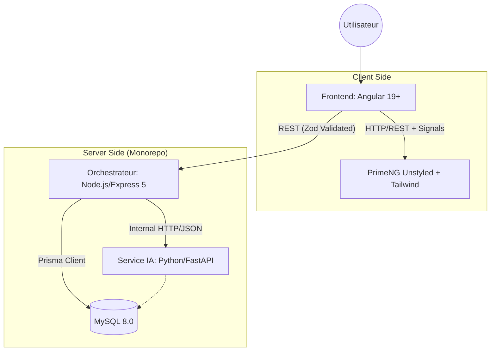

# 📋 ANTIGRAVITY ERP - Architecture Rules 2026

> **Version**: 2.0.0 (Revisé)  
> **Date**: 2026-01-29  
> **Statut**: VALIDÉ POUR DÉVELOPPEMENT  
> **Stack**: Full-Stack TypeScript + Python Service

---

## 1. 🏗️ Architecture Globale & Flux de Données



---

## 2. 🎯 Décision ORM & Data : PRISMA + ZOD

### Pourquoi ce choix en 2026 ?

Pour un ERP, la **sécurité du typage** est la priorité absolue. Nous couplons **Prisma** (Base de données) avec **Zod** (Validation API).

| Technologie | Rôle | Règle d'or |
|-------------|------|------------|
| **Prisma** | Accès BDD | Ne jamais écrire de SQL brut sauf cas extrême (`$queryRaw`). |
| **Zod** | Validation | Tout payload entrant dans l'API Node DOIT être validé par un schéma Zod. |
| **MySQL 8** | Stockage | Utiliser le mode JSON natif pour les configurations produits complexes. |

---

## 3. 🅰️ Règles Frontend (Angular 19+)

### 3.1 Architecture "Signal-First" (OBLIGATOIRE)

Nous abandonnons RxJS pour la gestion d'état synchrone au profit des **Signals** et de **NgRx SignalStore**.

```typescript
// ✅ CORRECT - NgRx SignalStore (Standard 2026)
import { signalStore, withState, withMethods, patchState } from '@ngrx/signals';
import { inject } from '@angular/core';

export const ArticleStore = signalStore(
    { providedIn: 'root' },
    withState({ articles: [], loading: false }),
    withMethods((store, articleService = inject(ArticleService)) => ({
        async loadAll() {
            patchState(store, { loading: true });
            const data = await articleService.getAll();
            patchState(store, { articles: data, loading: false });
        }
    }))
);
```

### 3.2 Composants Standalone & Control Flow

**Interdiction stricte des NgModules.** Utilisation exclusive de la nouvelle syntaxe de template.

```html
@if (store.loading()) {
    <p-skeleton width="100%" height="2rem" />
} @else {
    @for (item of store.articles(); track item.id) {
        <app-article-card [article]="item" />
    } @empty {
        <p>Aucun article trouvé.</p>
    }
}
```

---

## 4. 🎨 UI/UX : PrimeNG "Unstyled" + Tailwind

### 4.1 La Philosophie "Passthrough"

PrimeNG fournit la **logique** (accessibilité, clavier, tri), Tailwind fournit le **look**.

> **Règle** : Ne jamais charger le CSS par défaut de PrimeNG (`theme.css`).

### 4.2 Configuration Global (AppConfig)

```typescript
// app.config.ts
providePrimeNG({
    theme: {
        preset: Aura, // Base preset
        options: {
            cssLayer: {
                name: 'primeng',
                order: 'tailwind-base, primeng, tailwind-utilities'
            }
        }
    }
})
```

### 4.3 Exemple de Composant Stylisé

```html
<p-table [value]="devis" [tableStyle]="{'min-width': '60rem'}" 
    styleClass="p-datatable-sm">
    <ng-template pTemplate="header">
        <tr class="bg-slate-50 border-b border-slate-200 text-slate-700 uppercase text-xs">
            <th class="p-4 font-semibold">Référence</th>
            <th class="p-4 font-semibold">Client</th>
            <th class="p-4 font-semibold text-right">Montant HT</th>
        </tr>
    </ng-template>
</p-table>
```

---

## 5. 🔌 Communication Hybride (Node ↔ Python)

### 5.1 Séparation des Responsabilités

**Node.js (Le Chef de Chantier) :**

- Gère l'Authentification (JWT).
- Gère le CRUD simple (Clients, Articles).
- Valide les données (Zod).
- **Il est le seul autorisé à répondre au Frontend.**

**Python (L'Ingénieur Bureau d'Études) :**

- Reçoit des données brutes de Node.
- Fait tourner les algos (Calepinage, Extraction image).
- Renvoie du JSON pur à Node.
- **N'est jamais exposé directement au public.**

### 5.2 Contrat d'Interface

Les échanges Node/Python doivent respecter un **contrat strict**.

```typescript
// Node.js Service
async callPythonOptimization(payload: DevisPayload): Promise<OptimizationResult> {
    try {
        const { data } = await axios.post(`${PYTHON_URL}/optimize`, payload);
        // Validation Zod de la réponse Python (Confiance n'exclut pas le contrôle)
        return OptimizationResultSchema.parse(data);
    } catch (error) {
        throw new Error("Erreur du moteur de calcul Python");
    }
}
```

---

## 6. 📁 Structure Monorepo (Nx Recommended)

```plaintext
/antigravity-erp
├── apps/
│   ├── frontend/          # Angular 19
│   │   ├── src/app/
│   │   │   ├── core/      # Guards, Interceptors
│   │   │   ├── features/  # Domaines (Devis, Atelier...)
│   │   │   └── ui/        # Composants "Dumb" réutilisables
│   ├── backend-node/      # Express/NestJS
│   │   ├── src/prisma/    # Schema & Migrations
│   │   └── src/api/       # Routes & Controllers
│   └── backend-python/    # FastAPI
│       ├── main.py
│       └── algorithms/    # Logique métier lourde
├── libs/                  # Code partagé (Interfaces TS)
├── package.json           # Dépendances globales
├── rules.md               # CE FICHIER
└── docker-compose.yml     # Orchestration locale (Node + Py + MySQL)
```

---

## 7. ✅ Plan d'Action Immédiat

### Phase 1 : Fondations (Jours 1-2)

- [x] Initialiser le projet
- [x] Mettre en place la DB MySQL + Prisma (`npx prisma init`)
- [ ] Connecter le MCP MySQL pour introspecter la base existante

### Phase 2 : Frontend Core (Jours 3-5)

- [x] Installer Angular 19+ + Tailwind + PrimeNG
- [x] Configurer le "Unstyled Mode"
- [ ] Installer NgRx SignalStore
- [ ] Créer le AppLayout (Menu latéral + Header)

### Phase 3 : Migration Données (Semaine 2)

- [x] Générer le schema Prisma depuis la DB existante
- [ ] Créer les premiers endpoints Node (CRUD Clients)
- [ ] Créer les vues Angular correspondantes (Tableaux Client)

---

## 🚫 RAPPEL TECHNIQUE

> **Pas de `any` en TypeScript. Jamais.**

- Si une table MySQL change → `npx prisma db pull` puis `npx prisma generate`
- Python doit toujours répondre en **moins de 30s** (sinon passer en mode Job Queue/Worker)
- Tout payload API validé par **Zod** avant traitement
